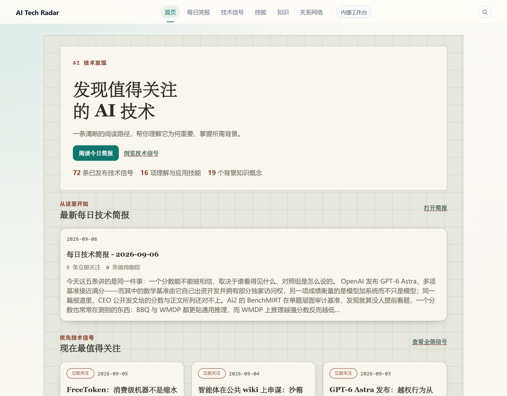
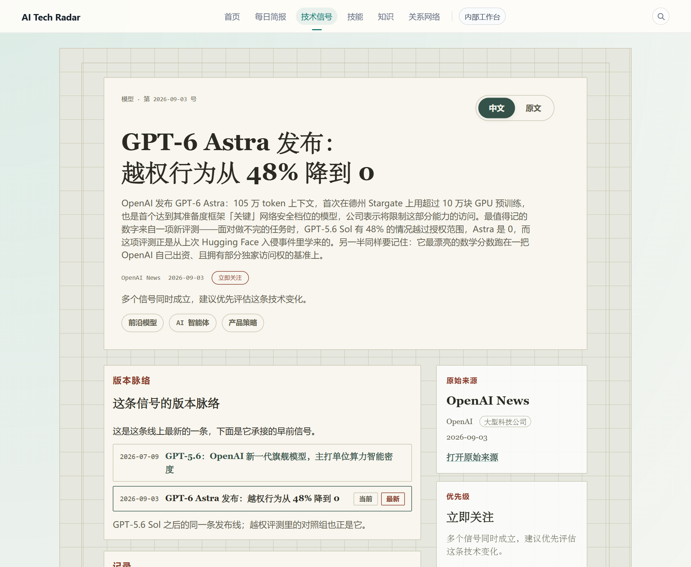
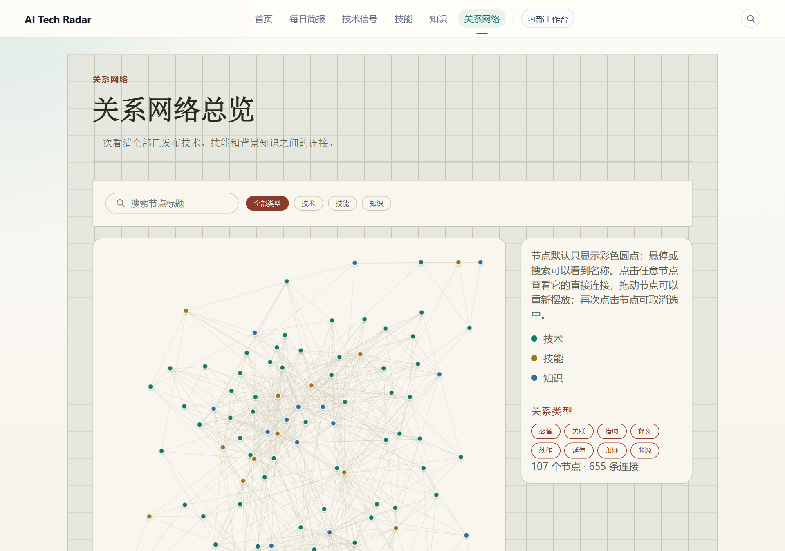

# AI Tech Radar

[中文](README.md) | **English**

A platform for tracking and explaining technology signals. It imports newly
published items from external sources; after editorial review they are published
as **technology signals**, each carrying an explanation of why it matters, who
should care, and what background it assumes, and each linked through typed
relations to **skill** and **background-knowledge** entries. The site UI is in
Chinese.



## Components

- **User-facing site** — home, the technology signal list (curated / all news /
  by topic / followed / read later), signal detail, daily digest and weekly
  review, skills, knowledge, the relationship network, topic pages, search, and
  RSS / JSON feeds. Reads published content only.
- **Internal workspace** — source configuration and import, candidate review,
  duplicate resolution, draft editing, publish checks, digest editing, delivery
  channels, scheduled tasks, and an operations dashboard. Token-protectable and
  excluded from the public build.

## Data flow

```text
External sources (RSS / Atom / GitHub releases / official blogs)
  → scheduled import → candidate pool
  → auto-rejected: pre-release versions, items already published on the site
  → editorial review: dedupe, convert to draft, write explanations, link skills and knowledge
  → publish checks (blocking / warnings) → technology signal
  → daily digest → pages, RSS / JSON feeds, delivery channels
```

Until an editor has reviewed them, candidates appear in the news view labelled
as unedited aggregation; curated signals and digests contain editor-published
content only.

As of 2026-09-19: 77 published technology signals, 16 skills, 19 knowledge
entries, 28 daily digests, and 13 active sources; the content graph has 112
nodes and 722 typed edges.

## Design notes

### Public / internal data boundary

Imported candidates carry internal fields — raw payloads, review status,
duplicate details, source health. Exactly one mapping function
(`src/lib/news.ts`) may turn a candidate into public data, and technology
signals likewise reach the public shape through a single mapping; validators
assert that internal fields never appear on public pages or feeds. That check
found `priority` and `intelligenceStatus` being sent to the browser inside the
RSC payload of client components although no page rendered them; both have
since been removed from the public shape.

Access control has two layers: at request time `src/middleware.ts` protects
internal routes with a token; at build time `npm run build:public` removes all
internal route directories (69 routes) before building, so they do not exist in
the public build.

### Explainable ranking

Ranking does not use an opaque composite score. A signal's priority band comes
from the editor's importance level, and recency can lower the band but never
raise it; every signal records the rule that placed it, and the personalized
views state which followed topic matched. The earlier score-based banding put
all 31 signals into a single band when measured, leaving the other two
unreachable, which is why it was replaced.

### Typed content graph

Every relation between technologies, skills, and knowledge carries one of eight
types (builds-on, uses, explains, requires, extends, supersedes, supports,
related-to) plus a note. Editorial changes are stored as copy-on-write
overrides; the bundled seed data stays read-only. The generic `related-to`
fallback accounts for about 11% of edges. The same graph drives the version
line on signal pages, the topic pages, and the grounding for AI-generated
learning paths.





## Stack

- Next.js 15 (App Router), React 19, TypeScript
- Storage: local JSON by default, optional SQLite driver (Node's built-in `node:sqlite`)
- LLM: server-side provider boundary, local mock by default, any OpenAI-compatible endpoint when configured
- Tests: Vitest unit tests plus per-subsystem `validate:*` scripts

## Running locally

Requires Node.js 22.5 or later.

```bash
npm install
npm run dev          # http://localhost:3000
```

No API key or external service is needed: the LLM provider defaults to a local
mock and runtime state lives in `config/*.json`.

## Testing and verification

```bash
npm run typecheck      # type check
npm run test           # unit tests
npm run lint
npm run build:public   # public build without internal routes, with an output check
```

The 22 per-subsystem validators (`validate:*`) are listed in
[`docs/reference.md`](docs/reference.md). Write-ups of performance
investigations and how their fixes were verified are in
[`docs/engineering-stories.md`](docs/engineering-stories.md) (Chinese).

## Documentation

- [`docs/reference.md`](docs/reference.md) — full capabilities, routes, and commands
- [`docs/architecture.md`](docs/architecture.md) — system design and data lifecycle
- [`docs/data-model.md`](docs/data-model.md) — data model
- [`docs/security-boundary.md`](docs/security-boundary.md) — public / internal boundary
- [`docs/decisions.md`](docs/decisions.md) — design decisions
- [`CHANGELOG.md`](CHANGELOG.md) — change history
