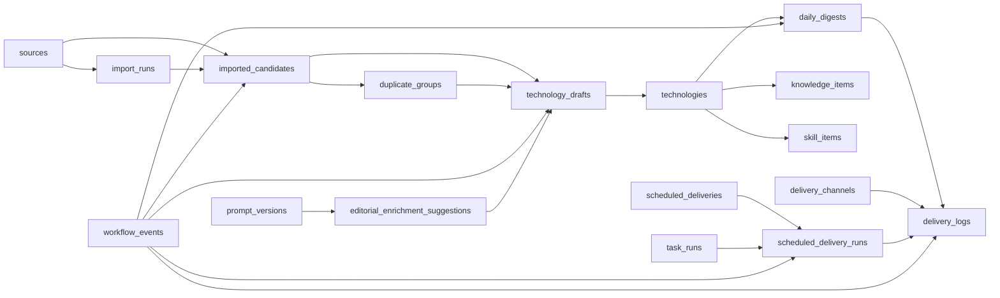

# Persistence Migration Plan v0

The project still defaults to local JSON, but Database Migration v0 now adds an optional SQLite driver. This document defines the storage boundary and the route from JSON to a production database.

## Current Local JSON Storage

Runtime workflow state defaults to `config/` and can be moved with `LOCAL_DATA_DIR`.

Current store files:

- `external-sources.json`: configured sources and recent import runs.
- `imported-candidates.live.json`: latest imported candidate snapshot and source snapshot records.
- `candidate-review-state.json`: candidate review status overrides and conversion links.
- `duplicate-groups.json`: persisted duplicate group decisions.
- `technology-workspace.json`: draft, published, and archived workspace technology records.
- `technology-drafts.json`: legacy draft store read as a fallback only.
- `daily-digests.json`: generated, edited, and published digest records.
- `delivery.json`: delivery channels and per-channel delivery runs.
- `scheduled-delivery.json`: delivery schedules and schedule run records.
- `task-runner.json`: local task-runner audit summaries.
- `workflow-events.json`: low-weight internal workflow events for state transitions, failures, and runner activity.
- `editorial-enrichment-suggestions.json`: workspace-only generated Content Intelligence suggestions.
- `prompt-versions.json`: workspace-only prompt templates and output schemas for editorial enrichment generation.

Static user-facing seed content still lives in `src/data/*`:

- published seed technologies
- knowledge items
- skill items
- topic tags
- link relations

## SQLite Driver v0

SQLite is optional and controlled by:

```bash
PERSISTENCE_DRIVER=sqlite
SQLITE_DATABASE_PATH=./config/ai-tech-radar.sqlite
```

Commands:

```bash
npm run db:init
npm run db:migrate-json
npm run validate:database
```

The SQLite driver uses Node's built-in `node:sqlite` module and does not introduce an ORM. It maps the existing workflow stores to SQLite tables through `src/lib/repositories/sqlite-store.ts`.

JSON remains the default fallback driver:

```bash
PERSISTENCE_DRIVER=json
```

## Why JSON Is Still Useful

Local JSON is useful for this stage because it keeps the full workflow inspectable without requiring infrastructure:

- quick local development
- deterministic validation scripts
- easy fixture editing
- no database dependency while workflow boundaries are still changing
- simple fallback for controlled single-operator demos

## JSON Limits

Local JSON is not a production persistence layer:

- no multi-writer locking
- no transaction isolation
- no referential integrity
- no schema migrations
- no efficient indexes
- no production secret storage
- weak audit guarantees
- easy to create stale references if files are edited manually

Production delivery endpoints, workspace access tokens, and other secrets must move to a proper secret store before public production use.

## Repository / Service Boundary

The current boundary is intentionally small:

- `src/lib/repositories/local-json-store.ts` owns local JSON file path resolution and read/write mechanics.
- Workflow services own business state transitions.
- App pages and API routes call workflow services and do not directly read or write JSON files.

Confirmed workflow service boundaries:

| Area | Repository / store file | Service / workflow owner | Mutating routes or UI |
| --- | --- | --- | --- |
| Sources | `external-sources.json` | `source-workflow.ts` | `/api/workspace/sources/*`, `/workspace/sources` |
| Import runs | `external-sources.json` | `source-workflow.ts` | batch and single-source import APIs |
| Imported candidates | `imported-candidates.live.json` | `candidate-workflow.ts`, `source-workflow.ts` | source import APIs, candidate refresh |
| Candidate review state | `candidate-review-state.json` | `candidate-workflow.ts` | `/api/candidates/[id]/status`, conversion API |
| Duplicate groups | `duplicate-groups.json` | `candidate-workflow.ts` | `/api/workspace/duplicates/[id]` |
| Technology drafts / workspace records | `technology-workspace.json` | `candidate-workflow.ts` | conversion, draft edit, status APIs |
| Published technologies | `technology-workspace.json` plus `src/data/technologies.ts` | `content.ts`, `candidate-workflow.ts` | publish status API |
| Knowledge / skills | `src/data/knowledge.ts`, `src/data/skills.ts` | `content.ts` | static in this phase |
| Daily digests | `daily-digests.json` | `digest-workflow.ts` | digest generate/edit/status APIs |
| Delivery channels / logs | `delivery.json` | `delivery-workflow.ts` | delivery channel APIs, send/retry APIs |
| Scheduled delivery | `scheduled-delivery.json` | `scheduled-delivery-workflow.ts` | schedule CRUD/run APIs |
| Task runner state | `task-runner.json` | `task-runner.ts` | `tasks:run-once`, `tasks:watch` |
| Editorial enrichment suggestions | `editorial-enrichment-suggestions.json` | `editorial-enrichment-store.ts`, `editorial-enrichment.ts` | workspace technology enrichment generate/apply/reject APIs |
| Prompt versions | `prompt-versions.json` | `prompt-versions.ts` | enrichment generation workflow |

Future database work should replace repository implementations first. Pages should continue calling the same workflow/service layer.

## Object Audit

| Object | Current storage | Internal-only fields | User-facing fields | Future DB fit |
| --- | --- | --- | --- | --- |
| `ExternalSource` | `external-sources.json` | URL config, enabled, source health, import defaults | none | yes |
| `ImportRun` | `external-sources.json` | run messages, per-source results | none | yes |
| `ImportedCandidate` | `imported-candidates.live.json` + review state | raw payload, import status, normalized type, duplicate hints | none | yes |
| `DuplicateGroup` | `duplicate-groups.json` | reasons, status, primary candidate | none | yes |
| `TechnologyWorkspaceRecord` | `technology-workspace.json` | source candidate ID, candidate source references, editorial notes, draft status | mapped public technology fields after publication | yes |
| Published `TechnologyItem` | static seed data + published workspace records | none after safe mapping | title, summary, content, source, tags, relations, priority label | yes |
| `KnowledgeItem` | `src/data/knowledge.ts` | none | title, summary, content, relations | yes, later |
| `SkillItem` | `src/data/skills.ts` | none | title, summary, content, relations | yes, later |
| `DailyDigest` | `daily-digests.json` | manual adjustment IDs, editorial notes, draft/archived status | published title, summary, selected technologies, skills, knowledge, sources | yes |
| `DeliveryChannel` | `delivery.json` | endpoint URL, enabled, channel config | none | yes, with secret split |
| `DeliveryRun` | `delivery.json` | request/response previews, retry linkage, errors | none | yes |
| `ScheduledDelivery` | `scheduled-delivery.json` | schedule time, channel IDs, last run status | none | yes |
| `ScheduledDeliveryRun` | `scheduled-delivery.json` | delivery log IDs, trigger type, run message | none | yes |
| `TaskRunnerRun` | `task-runner.json` | command-run summaries and sanitized messages | none | yes |
| `WorkflowEvent` | `workflow-events.json` | before/after snapshots, workflow metadata, sanitized errors | none | yes |
| `EditorialEnrichmentSuggestion` | `editorial-enrichment-suggestions.json` | source inputs, generation mode, provider/model/prompt metadata, promptVersionId, token usage, validation warnings, generation errors, reviewer notes, quality score/labels, rejection reason, applied fields | applied generated fields only after draft update | yes |
| `PromptVersion` | `prompt-versions.json` | prompt template, output schema, status, notes | none | yes |

## Suggested Future Tables / Collections

Minimum future persistence set:

- `sources`
- `import_runs`
- `import_run_source_results`
- `imported_candidate_snapshots` or `imported_candidate_sources`
- `imported_candidates`
- `candidate_review_states`
- `duplicate_groups`
- `duplicate_group_candidates`
- `technology_drafts`
- `technologies`
- `technology_source_references`
- `knowledge_items`
- `skill_items`
- `topic_tags`
- `link_relations`
- `daily_digests`
- `daily_digest_items`
- `delivery_channels`
- `delivery_logs`
- `scheduled_deliveries`
- `scheduled_delivery_runs`
- `task_runs`
- `workflow_events`
- `editorial_enrichment_suggestions`
- `prompt_versions`

## Relationship Map



## Index Candidates

Recommended indexes for a database-backed version:

- `sources.url` unique normalized index.
- `sources.enabled`, `sources.type`, `sources.lastImportStatus`.
- `import_runs.startedAt`.
- `imported_candidates.sourceId`, `imported_candidates.sourceUrl`, `imported_candidates.importStatus`, `imported_candidates.publishDate`.
- `imported_candidates.importRunId`.
- normalized candidate title or title hash for duplicate detection.
- `duplicate_groups.status`.
- join index on `duplicate_group_candidates.candidateId`.
- `technology_drafts.status`, `technology_drafts.slug`, `technology_drafts.sourceCandidateId`.
- `technologies.slug` unique, `technologies.status`, `technologies.publishDate`.
- `daily_digests.date` unique, `daily_digests.status`.
- `delivery_logs.digestDate`, `delivery_logs.channelId`, `delivery_logs.status`, `delivery_logs.startedAt`.
- `scheduled_deliveries.enabled`, `scheduled_deliveries.nextRunAt`.
- `scheduled_delivery_runs.scheduleId`, `scheduled_delivery_runs.digestDate`, `scheduled_delivery_runs.startedAt`.
- `task_runs.startedAt`, `task_runs.status`.
- `workflow_events.entityType`, `workflow_events.entityId`, `workflow_events.action`, `workflow_events.createdAt`.
- `prompt_versions.purpose`, `prompt_versions.status`, `prompt_versions.version`.
- `editorial_enrichment_suggestions.technologyDraftId`, `editorial_enrichment_suggestions.status`, `editorial_enrichment_suggestions.promptVersionId`.

## Flows That Need Transactions Later

Current JSON writes are small and synchronous, but they are not atomic across multiple files. Database migration should make these workflows transactional:

1. Candidate -> technology draft
   - Current JSON behavior: writes `technology-workspace.json`, then updates `candidate-review-state.json`.
   - Hardening v1: repeated conversion returns the existing draft; failed readiness records `candidate.convert_failed`; review-state write failure attempts to restore the prior draft store before rethrowing.
   - Future transaction: create/upsert draft and mark candidate(s) converted in one transaction.
   - Current risk: compensation is best-effort under JSON and store-compatible SQLite; production should make draft upsert and candidate status update one database transaction.

2. Duplicate group resolved -> primary candidate -> references
   - Current JSON behavior: group decision is persisted separately from later draft conversion.
   - Future transaction: resolve group, validate primary, and lock candidate conversion path.
   - Current risk: manual file edits can leave primary IDs inconsistent.

3. Draft -> published TechnologyItem
   - Current JSON behavior: publish readiness is checked before writing workspace record status.
   - Hardening v1: blocked publish records `draft.publish_failed`; successful publish records `draft.published`.
   - Future transaction: check slug uniqueness and publish record with a database uniqueness constraint.
   - Current risk: concurrent editors could publish duplicate slugs.

4. Digest generate / regenerate
   - Current JSON behavior: generated sections and preserved manual fields are merged into one file write.
   - Future transaction: recompute generated rows while preserving manual override rows.
   - Current risk: regenerate can race with editor changes in a multi-user scenario.

5. Digest publish
   - Current JSON behavior: readiness check then status update in `daily-digests.json`.
   - Hardening v1: blocked publish records `digest.publish_failed`; successful publish records `digest.published`.
   - Future transaction: validate selected published technology references and publish digest atomically.
   - Current risk: referenced technology status can change between check and write.

6. Digest delivery log write
   - Current JSON behavior: delivery run and channel last-delivery fields are written together in `delivery.json`.
   - Hardening v1: success and failure both record workflow events in addition to `DeliveryRun`.
   - Future transaction: insert delivery log and update channel status together.
   - Current risk: log and channel status can drift if a write fails.

7. Scheduled delivery run
   - Current JSON behavior: per-channel delivery logs are written by delivery workflow, then schedule run is written.
   - Hardening v1: schedule runs record workflow events and continue to skip same-day duplicate scheduled sends for the same schedule / digest / channel.
   - Future transaction or saga: record schedule run, per-channel logs, skipped state, and schedule next run consistently.
   - Current risk: channel delivery can succeed without a schedule run record if the second write fails.

8. Source import -> candidates -> source health update
   - Current JSON behavior: candidate snapshot and source health/import run are updated in separate files.
   - Future transaction: insert imported candidates, import run, per-source result, and source health update together.
   - Current risk: imported candidates can exist without matching health/run metadata, or vice versa.

## Sensitive / Internal Fields

Sensitive or internal fields must not be exposed through public pages or public feeds:

- source configuration URLs when they contain private tokens
- delivery `endpointUrl`
- webhook request/response previews
- workspace access token
- `rawPayload`
- `importStatus`
- `normalizedType`
- `duplicateGroupId`
- duplicate reasons and primary selection
- candidate quality flags
- source quality metrics
- digest manual adjustment IDs
- digest editorial notes
- schedule configuration and run logs
- task runner messages
- workflow event before/after snapshots and workflow metadata

## Recommended Migration Order

1. Move `sources`, `import_runs`, `imported_candidates`, and `candidate_review_states` first.
2. Move `duplicate_groups` and duplicate membership joins.
3. Move `technology_drafts`, `technologies`, and source references.
4. Move `daily_digests` and digest item joins.
5. Move `delivery_channels`, `delivery_logs`, `scheduled_deliveries`, and runner audit records.
6. Move `workflow_events` with event retention and sanitization rules.
7. Move static `knowledge_items`, `skill_items`, tags, and relations when content editing becomes real.
8. Replace local JSON repository functions with database-backed repositories while keeping workflow functions stable.

## Why No Database In This Phase

The first database step is deliberately local and reversible. SQLite v0 proves schema shape, JSON migration, and driver switching while avoiding production database operations, cloud credentials, and a heavy ORM. A production database migration still needs real migration files, locking, backup/restore, secret storage, and full cross-workflow transaction design.

## Validation

Run:

```bash
npm run validate:persistence
npm run validate:database
npm run validate:workflow-hardening
```

The script checks core references across local JSON and static content:

- candidate source traceability
- converted candidate -> draft links
- duplicate group candidate references
- duplicate group primary membership
- technology related knowledge / skill references
- digest published technology references
- delivery log digest / channel references
- schedule channel references
- schedule run delivery-log references
- public technology and digest feed internal-field isolation
- local store paths resolving under `LOCAL_DATA_DIR`

`validate:database` additionally checks:

- SQLite schema creation
- JSON -> SQLite migration
- seeded static content in SQLite
- SQLite driver reads for core workflow data
- JSON driver fallback still reads
- user-facing data isolation under both drivers

`validate:workflow-hardening` additionally checks:

- failed candidate conversion does not incorrectly mark the candidate converted
- non-primary duplicate candidates cannot generate standalone drafts
- repeated conversion does not create duplicate drafts
- duplicate references are preserved on the primary draft
- slug conflicts block draft publication
- digest readiness blocks unpublished technology references
- failed delivery still creates a failed log and workflow event
- scheduled delivery duplicate protection prevents repeated same-day sends
- workflow event data is internal-only and sanitized
